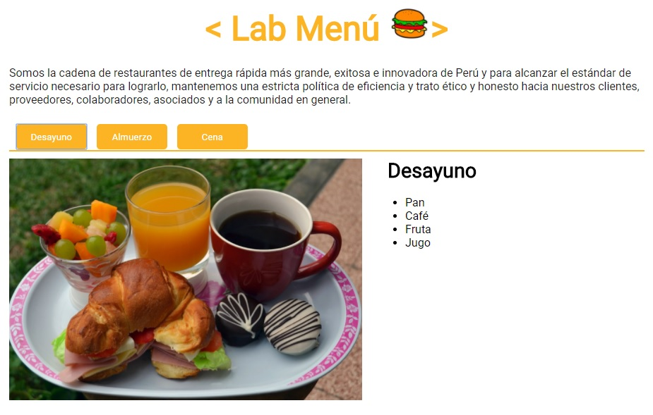

# Tab Menu #

Una empresa que vende comida en tres tiempos, quiere darles a sus clientes una visualización web del menú para el día.
Se requiere que el sitio contenga el nombre de la empresa, descripción de la empresa y una sección que cuente con tres tabs o pestañas:
* desayuno
* almuerzo
* cena

Acontinuación una vista de la aplicación:

## ¿Cómo usar? ##

* Al clickear en cada pestaña se muestra el contenido del platillo y una imagen referencial.
* El contenido de cada pestaña se oculta al actualizar la página.

## ¿Cómo se elaboró?
* Usando el concepto de tabs, los cuales sirven para agrupar contenido similar usando solo un espacio.
* Se replicó esa funcionalidad usando DOM y CSS.